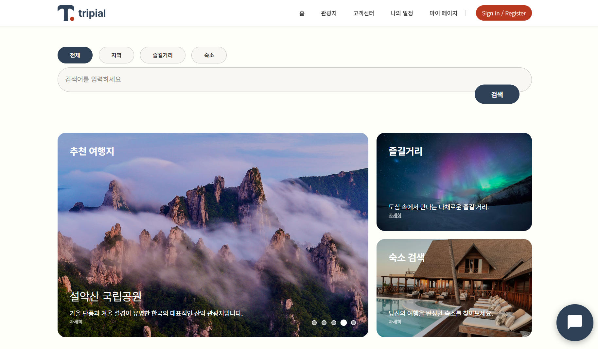

# Tripial - 트립피얼

**By: AIBE5_Project1_Team8**

> **여행의 시작부터 끝까지, 당신의 여정을 위한 맞춤형 가이드** 
> 여행 계획을 사소할 정도로 쉽게!

  

## 1. 프로젝트 개요
Tripial(트립피얼)은 “여행”의 “Trip”과 “사소한”의 “Trivial”(트리비얼)을 합쳐 만든 혼성어로, 여행지 선택 과정에서 오는 결정 피로를 해결하고, 사용자에게 최적화된 여행 경험을 제공하기 위한 플랫폼입니다. 

대한민국 지도 기반의 직관적인 검색과 생성형 AI를 활용한 맞춤형 추천 서비스를 통해 사용자의 선택에 도움을 주고, 실시간 공공데이터를 연동하여 관광지의 최신 정보를 바로 불러오며, 일정 · 숙소 · 즐길거리를 모두 한 프로젝트에 통합하여 Tripial 하나만으로 여행의 모든 것을 해결합니다. 

**개발 기간:** 2026.01.23 ~ 2026.01.29

## 2. 프로젝트 기획서
- **Google Docs (기획서):** [기획서 바로가기](https://docs.google.com/document/d/1lC6pMJFUVG0xZJYS4ucyPysfBe4y6eBV1InFxHeBTUc/edit?usp=sharing)
- **Notion (프로젝트 소개):** [Notion 바로가기](https://www.notion.so/2f63550b7b55800fa5caeffb8a4ab3e1?source=copy_link)

## 3. 기술 스택 (Tech Stack)

### Frontend
- **HTML5**
- **CSS**
- **JavaScript**
    - **leaflet.js:** 상호작용 가능한 대한민국 지도 시각화

### Backend & AI
- **Python:** 백엔드 로직 처리
    - **Google Gen AI Python SDK:** Google Gemini API 연동

### Database
- **Firebase Hosting:** 웹사이트 배포 및 백엔드 로직 보안 처리
- **Firebase Web SDK:** 브라우저 내 데이터베이스 기능 호출, 사용자 정보 저장 및 관리

### External API
- **한국관광공사 국문 관광정보 서비스 OpenAPI:** 전국 관광지 정보 및 이미지 데이터 활용

## 4. 주요 기능 (Key Features)

* **지도 기반 관광지 추천 서비스**
    * leaflet.js를 활용한 대한민국 지도 인터페이스 제공
    * 추천 관광지 클릭 시 해당 지역의 관광지 정보 제공

* **생성형 AI 기반 여행지 추천 챗봇**
    * Google Gemini를 기반으로 하는 실시간 챗봇
    * 사용자의 대화를 기반으로 실시간 맟춤 여행지 추천

* **여행 후기 및 커뮤니티**
    * 여행지별 사진 업로드 및 별점 평가 기능
    * 사용자 간 생생한 여행 경험 공유

* **일정 및 예약 관리**
    * 숙소 예약 및 취소 기능
    * 나만의 여행 일정 생성 및 관리

* **회원 관리**
    * 회원가입, 로그인, 마이페이지(정보 수정/탈퇴) 기능 제공

## 5. 팀원 구성 (Team Members)

| 이름 | 역할 | 담당 업무 | GitHub |
| :---: | :---: | :--- | :---: |
| **정준후** | 팀장 | 관광지 페이지 및 상세 정보 페이지 레이아웃 구현 기획 총괄 | [Github](https://github.com/suzibd) |
| **전우현** | 팀원 | 숙소 예약 및 결제 페이지 레이아웃 디자인  숙소 예약 및 결제 기능 구현 기초 유효성 검사 | [Github](https://github.com/jwh039) |
| **황보혜** | 팀원 | 마이페이지 레이아웃 디자인 및 기능 구현 나의 일정 페이지 디자인 및 기능 구현  데이터베이스 연동 및 데이터 구조 관리 발표 내 서비스 시연 진행 | [Github](https://github.com/hwangbohye03) |
| **이근찬** | 팀원 | 여행 후기 작성 페이지 디자인 및 기능 구현 데이터베이스 기능 구현 서버 내 사용자 개인정보 관리 | [Github](https://github.com/geunchanlee) |
| **이상민** | 팀원 | 전체 페이지 디자인 레이아웃 구성 메인 페이지, UI, 메뉴바/검색바 구현 데이터베이스 관리 검수/검토, 발표자료 작성 및 발표 진행 | [Github](https://github.com/Paley-Z) |
| **박수빈** | 팀원 | 고객센터 기능 및 UI 구현 모달 창 및 토스트 알람 기능 구현 | [Github](https://github.com/SooBin111) |
| **김진현** | 팀원 | AI 기반 여행지 추천 챗봇 디자인 및 기능 구현 지도와 연동된 여행지 검색 로직 구현 웹사이트 호스팅 기능 구현 기획서, 명세서, 발표 대본 작성 | [Github](https://github.com/jinhyenkim01) |
